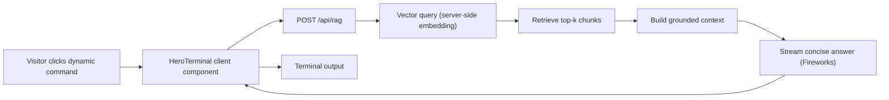

# RAG Terminal Architecture

**Status:** Planned
**Landing surface:** `components/hero/HeroTerminal.tsx`
**Default mode:** static

This document defines the target architecture for adding a dynamic,
retrieval-backed terminal to the landing-page hero while keeping the current
static terminal intact.

## Product Shape

The hero terminal has two modes:

- `static` — the current implementation. Six command chips render deterministic
  local payloads from `data/*.ts`. This is the default on page load.
- `dynamic` — the same terminal shell and command chips call a backend RAG
  route. The answer is grounded in the portfolio corpus and streamed into the
  terminal output area.

The mode switch replaces the current terminal label text:

```txt
terminal  [static] [dynamic]
```

When `dynamic` is selected and no command has run yet, the body shows a blinking
prompt:

```txt
$ mehboob@portfolio-bastion:
```

The prompt should use existing token colors only: `text-acc` for the username
or host accent, `text-t2`/`text-t3` for muted shell syntax, and the existing
terminal cursor animation from `HeroTerminal.css`.

## High-Level Flow



## Proposed Stack

| Layer | Choice | Notes |
|---|---|---|
| Provider switch | `LLM_PROVIDER=fireworks` by default | Future values: `gemini`, `groq`, `openai`. See `docs/rag/PROVIDERS.md`. |
| Chat model | Fireworks OpenAI-compatible API | Default: `accounts/fireworks/models/gpt-oss-120b`. Chat only — no embeddings from Fireworks. |
| Embeddings | Upstash Vector built-in (server-side) | Model + dims overridable via `RAG_UPSTASH_EMBEDDING_MODEL` / `RAG_UPSTASH_EMBEDDING_DIMENSIONS`. Default: `openai/text-embedding-3-small`, 1536 dims. The application never calls an embeddings SDK. |
| Vector store | Upstash Vector | Serverless, Vercel-friendly REST API. Index pre-created at `us1`, `dense`, `cosine`. |
| Streaming | OpenAI-compatible streaming response | Server route streams text; client reads the response. |
| Indexer | Local script | Reads registries and docs, sends chunk text to Upstash (`data`-mode upsert); Upstash embeds server-side. |

## Provider Toggle

The RAG route and reindex script should not import Fireworks-specific logic
directly. They should call a reusable provider adapter selected by:

```txt
LLM_PROVIDER=fireworks
```

Provider key convention:

| Provider | Required env var |
|---|---|
| `fireworks` | `FIREWORKS_API_KEY` |
| `gemini` | `GEMINI_API_KEY` |
| `groq` | `GROQ_API_KEY` |
| `openai` | `OPENAI_API_KEY` |

For Fireworks, use the OpenAI-compatible base URL:

```txt
https://api.fireworks.ai/inference/v1
```

Do not enable Fireworks reasoning/thinking options for this portfolio terminal.
Answers should be final-text only.

## Runtime Boundaries

- `HeroTerminal.tsx` remains a Client Component because it owns terminal mode,
  active command, streaming output, and keyboard behavior.
- `app/api/rag/route.ts` is server-only and must import model/vector clients
  only inside the route boundary.
- No provider, model, or Upstash keys are exposed to the client.
- No browser storage is used. Static mode remains default on every load.
- No project, experience, or contact content is hardcoded in JSX. Static mode
  keeps reading from `data/*.ts`; dynamic mode reads from the indexed corpus.

## Route Contract

Request:

```json
{
  "command": "projects",
  "question": "What are Mahboob's strongest backend projects?"
}
```

Response:

- `200` streaming text when env vars and vector index are available.
- `400` for invalid command/question payloads.
- `503` with a short terminal-safe message when dynamic mode is not configured.

The client should gracefully render `503` responses as terminal output and
leave static mode untouched.

## Command Mapping

| Command | Dynamic question |
|---|---|
| `whoami` | "Summarize who Mahboob Alam is, what he is building, and what kind of roles fit him." |
| `projects` | "What are Mahboob's most relevant backend and platform projects?" |
| `stack` | "What technologies has Mahboob used in real projects, and where?" |
| `latest` | "What is Mahboob currently building or writing about?" |
| `contact` | "How can someone contact Mahboob and what should they contact him for?" |
| `help` | "Explain what this portfolio terminal can answer." |

## Grounding Rules

The system prompt must enforce:

- Answer only from retrieved context.
- Be concise: 3-6 sentences or short terminal-style bullets.
- Prefer concrete project names, roles, metrics, and links from the corpus.
- If context is missing, say so and point to `/lets-connect`.
- Do not invent dates, employers, metrics, private client names, or production
  claims.

## Failure Modes

| Failure | User-visible behavior |
|---|---|
| Missing env vars | Dynamic output says dynamic mode is not configured yet. |
| Vector query failure | Dynamic output asks the visitor to try static mode or `/lets-connect`. |
| Model timeout | Output stops with a short "request timed out" line. |
| Empty retrieval | Output says the corpus does not contain that answer. |

Static mode should never depend on any dynamic dependency or env var.

## Voice and System Prompt

The dynamic terminal's tone is governed by two corpus files, both indexed and
retrieved at runtime, so editing them ships via `pnpm rag:reindex` without
a code redeploy:

- `docs/rag/corpus/system-prompt.md` -> `kind: "system-prompt"` chunks.
  Carries the literal instruction:
  > Keep responses informative, polite, and helpful. Aim for 120 to 180 words.
  > Start with natural first-person statements (like "My strengths are...")
  > instead of technical lists. Transition third-person queries warmly to first
  > person. For capability queries, defend capability in first person and balance
  > with growth areas (Go, Terraform, Kubernetes, eBPF) positively. Avoid
  > AI slop (strive, delve, certainly). At most 2 bullets.
- `docs/rag/corpus/voice.md` -> `kind: "voice"` chunks. Carries the writing
  rules (first person, short sentences, named tools, no buzzwords, decline
  gracefully).

The route concatenates these chunks before the user message, in this order:

1. System prompt (instruction).
2. Voice rules (style).
3. Retrieved grounding context.
4. User question.

The chat model is `accounts/fireworks/models/gpt-oss-120b` — non-reasoning.
The route never sends `reasoning_effort`, `thinking`, `reasoning_history`,
or reads `reasoning_content`.

The existing `docs/rag/corpus/{bio,hiring,project-deep-cuts,writing-notes,contact-policy,private-boundaries}.md`
files are reserved for richer first-person material that supplements the
programmatic chunks. They do not define the terminal's tone.
